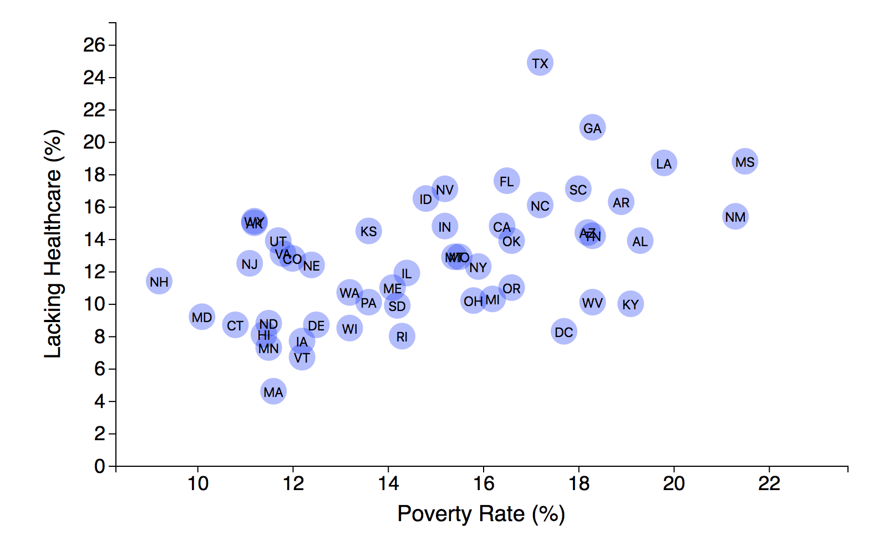

# d3-data-journalism
Data Journalism with D3 -- a project part of the USC Data Analytics Certificate Program

We use D3.js to visualize correlations between economic conditions and health outcomes.

